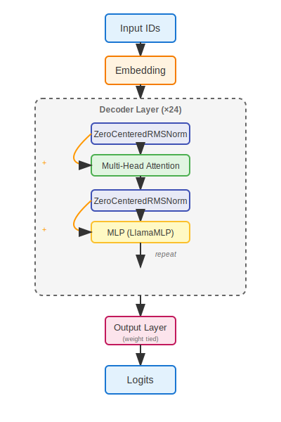

Baseline basic transformer model vaguely modeled after llama 3. This repo is primarily for refrence but the model is trainable:

To train on all of tinystories-hf for one epoch:
```python
uv run python main.py
```

Inference on the resulting model:
```
uv run python basic_inf.py
```

# Training Notes

**Efficient Unpadded Sequence-Packed Training** — Instead of padding sequences to a fixed length, we concatenate multiple sequences into one tensor and track their boundaries. This means zero wasted computation on padding tokens and higher throughput.

**Linear Cross Entropy Loss** — Computes cross entropy directly from embeddings and classifier weights without materializing the full `[batch, vocab_size]` logit tensor ([Cut Your Losses](https://arxiv.org/abs/2411.09009)). Saves a ton of memory with large vocabularies and is numerically more stable.

**Picky Weight-Decay** — AdamW is pretty good but weight decay can cause stability issues if applied on certain layers, this presents a pickier strategy for weight-decay.

# Architecture Notes

**Zero Centered RMS Norm** — Idea from Qwen3-Next's architecture, this adds some stability and better apparent training metrics early on, during inference given a long enough training run this will weight-decay to be equivalent to regular RMS Norm.

**Weight Tying** — Classic old strategy of simply weight-tying the output layer to the input layer, this saves about 18% of our models overall parameters letting us get more transformer layers.

**Standard Llama 3 MLP** — Just a bog standard llama MLP, nothing special or interesting about it.

**Multi-Head Attention** — Extremely standard using flash attention varlen to do the efficiently unpadded training. This is about as basic as modern attention gets. It's ungated which is a low hanging fruit to improve performance a few points.
